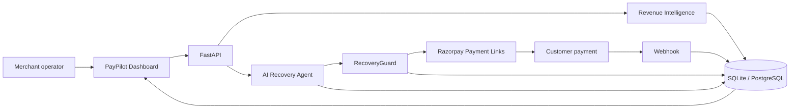

# PayPilot architecture

PayPilot is a single FastAPI service plus a Next.js operations UI. SQLite stores the ledger locally; the SQLAlchemy models are ordinary relational tables so PostgreSQL can replace SQLite by changing `DATABASE_URL`.

## Loop

Merchant → PayPilot Dashboard → FastAPI → Revenue Intelligence → AI Recovery Agent → RecoveryGuard → Razorpay → Payment → Webhook → Database → Dashboard.

## Components

### Dashboard (Next.js)

Reads metrics from `/api/dashboard`. It never hardcodes revenue figures. Command bar calls `/api/command` so natural language maps to ledger queries, not generic chatbot text.

### FastAPI

REST API under `/api`. CORS is limited to `FRONTEND_URL`. Razorpay secrets are settings on the server only.

### Revenue Intelligence

`analytics_service` computes:

- **Total revenue**: sum of `captured` payments  
- **Revenue at risk**: unpaid failed / abandoned / pending amounts  
- **Recoverable revenue**: sum of `expected_recovery` on open opportunities (`amount × probability`)  
- **Actual recovered revenue**: amounts on transactions marked `recovered`

These four numbers are intentionally different.

### Demo scoring model

`services/scoring.py` is labelled as a demo model. Features: successful vs failed history, LTV, amount, failure reason, method, recency, prior recovery attempts. Output is 0–1, then HIGH / MEDIUM / LOW.

### AI Recovery Agent

`ai_service.recommend_recovery` tries OpenAI when `AI_MODE` is not `local` and a key exists. On any failure or missing key it uses the local engine and sets `ai_source=local_recovery_engine`. It only reasons over the JSON payload.

### RecoveryGuard

Sits between the agent and Razorpay. Checks amount, customer, duplicates, risk, action type, autonomous limit, and refund prohibition. Labels: `AUTO APPROVED`, `HUMAN APPROVAL REQUIRED`, `DUPLICATE BLOCKED`, `NO ACTION`.

### Razorpay service

`POST /v1/payment_links` with amount in paise, INR, `reference_id`, customer, notes, `reminder_enable`. In `RAZORPAY_MODE=demo` this HTTP call is skipped and a clearly labelled demo URL is stored. API errors are returned to the client; success is never invented.

### Webhooks

`POST /api/webhooks/razorpay` verifies HMAC SHA256 when `RAZORPAY_WEBHOOK_SECRET` is set. Test mode refuses unsigned webhooks. Demo simulation is a separate authenticated API used only when mode is demo.

### Database

Customers, transactions, recovery opportunities, agent actions, payment links. Seed data is deterministic (`app/seed/seed_data.py`) so restarting the app reproduces the same story: loyal customers with temporary bank timeouts, thin-history customers with blocked instruments, mixed insufficient-funds cases, and a few ₹49,999 / ₹24,999 leaks.
